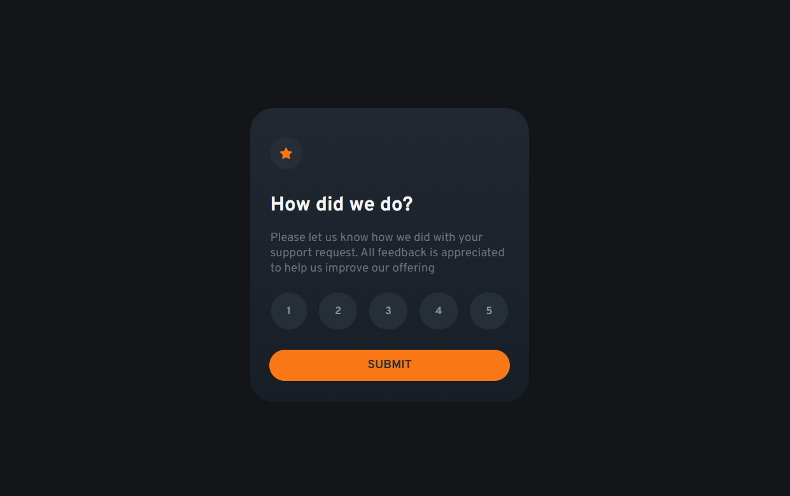

# Interactive rating component

## Table of contents

- [Overview](#overview)
  - [Screenshot](#screenshot)
  - [Links](#links)
- [My process](#my-process)
  - [Built with](#built-with)
  - [What I learned](#what-i-learned)
- [Author](#author)

## Overview

A simple rating component created by using vanilla JavaScript and HTML/CSS.

### Screenshot



### Links

- Live Site URL: [Rating Component Site](https://rating-rai.netlify.app/)

## My process

### Built with

- Semantic HTML5 markup
- CSS custom properties
- Flexbox

### What I learned

I learned how to organize the rating system within a form in my HTML:

```html
<form>
  <fieldset class="score-buttons">                        
    <button type="button">1</button>
    <button type="button">2</button>
    <button type="button">3</button>
    <button type="button">4</button>
    <button type="button">5</button>
  </fieldset>
```

  Also, I learned how to hide the <fieldset> default borders in CSS.

  For the first time, I was able to hide a full container by using "display: none" in CSS to be later shown by targeting CSS styles with element.style in JavaScript:
  
  ```js
  submitEl.addEventListener('click', function(e){
    e.preventDefault()
    container.style.display = 'none'
    hiddenEl.style.display = 'flex'

    const rating = localStorage.getItem("rating")
    ratingText.textContent = `You selected ${rating} out of 5`
})
```

In this code, the preventDefault() can also be seen. It was useful to prevent the browser from reloading the DOM after clicking on the "submit" button. I could have changed the type in the HTML (from "submit" to "button"), but I wanted to maintain consistency.

Finally, I learned how to disable an element like submitEl.disabled = true to later activate it when a button is clicked:

```js
for (let i = 0; i < ratingButtons.length; i++){
    ratingButtons[i].addEventListener('click', function(){
        const selectedRating = ratingButtons[i].textContent
        localStorage.setItem("rating", selectedRating)
        submitEl.disabled = false
    })
}
```

## Author

- Website - [Rainiero Herrada](https://www.rainieroherrada.com)
